# RN-Movies

## Project Summary

RN-Movies is a Laravel-based movie discovery and review application built with Livewire for a responsive, interactive user interface. Users can browse top-rated movies, search for titles, view movie details with cast and genre information, leave reviews, and manage personal watchlists, favorites, and watched status. An authenticated admin area supports movie, genre, review, user management and logs.

## Features

- Top-rated movie landing page
- Movie search and browsing
- Movie detail pages with reviews and metadata
- Genre listing and per-genre movie pages
- User authentication with login, registration, and profile access
- Add and remove reviews for authenticated users
- Toggle movie watchlist, favorites, and watched status
- Admin dashboard for movies, genres, reviews, users, and logs

## Technologies Used

- PHP 8+ / Laravel 11+ framework
- Livewire for reactive UI components
- Blade templates for server-rendered views
- MySQL / database supported by Laravel Eloquent ORM
- Tailwind CSS / frontend styling assets
- Docker and Docker Compose for local development

## Photos
### Database Schema
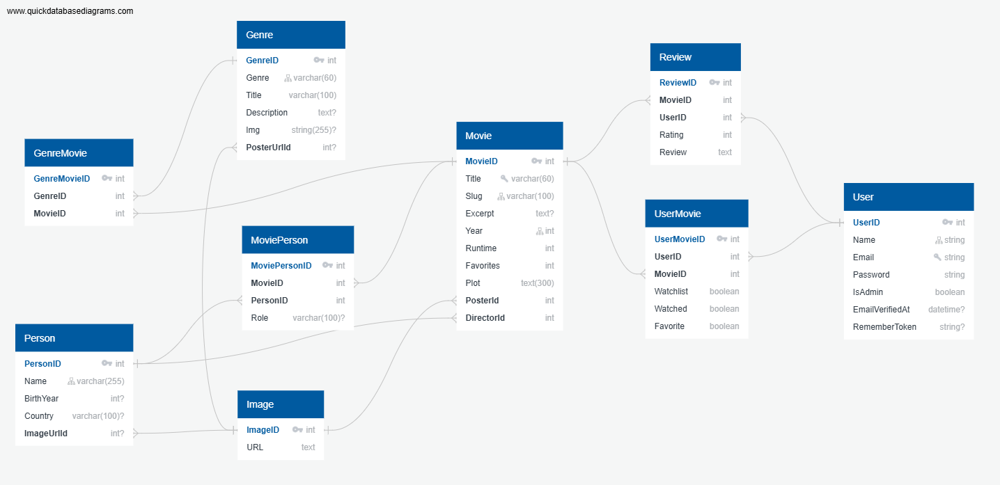
### Home page
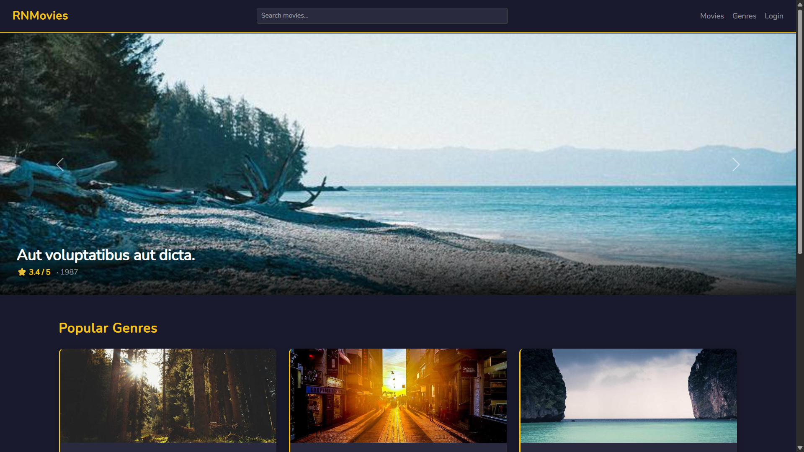
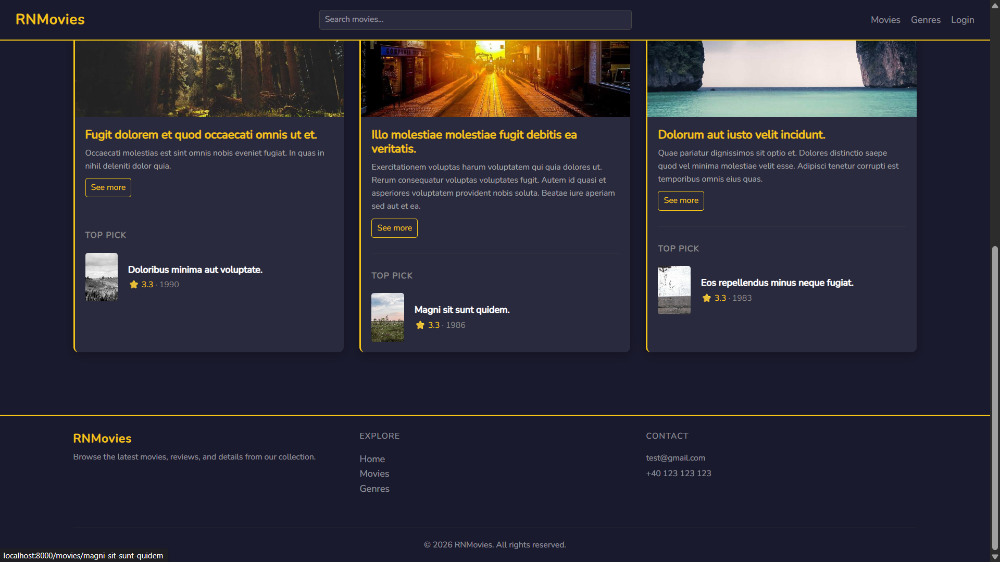
### Movies Page
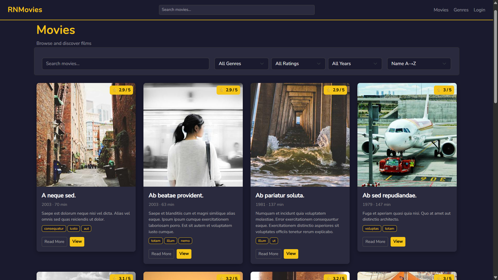
### Movie Page
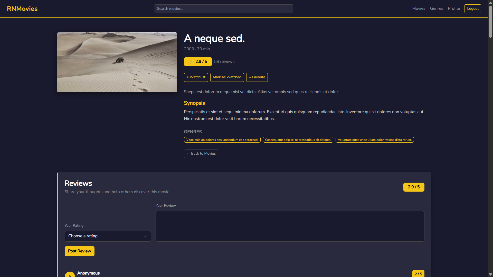
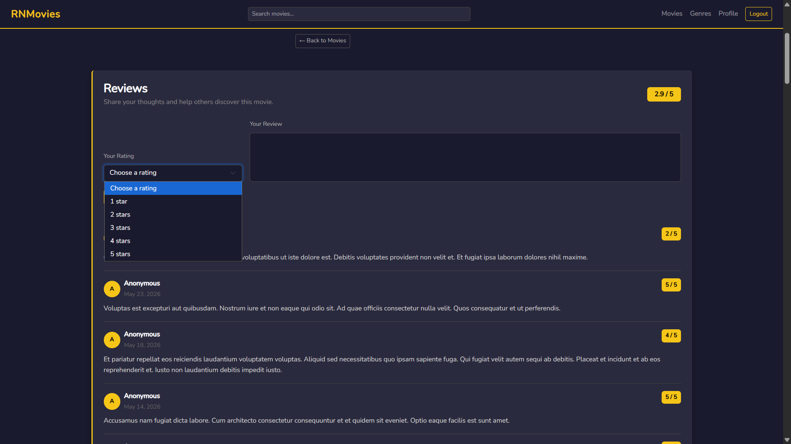
-Genres Page
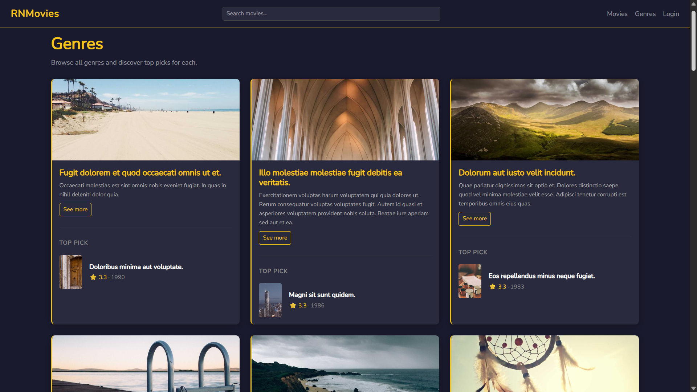
###Login Page
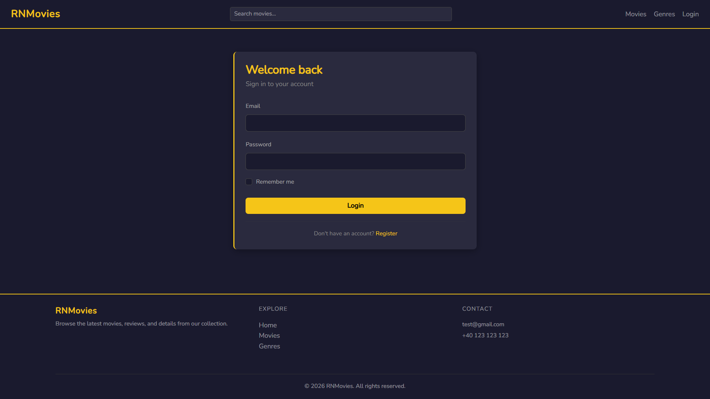
### Register Page
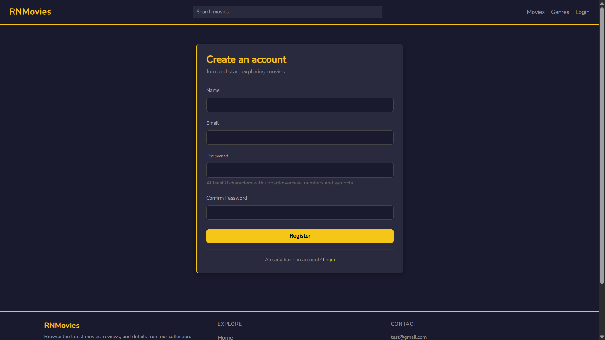
### Profile Page
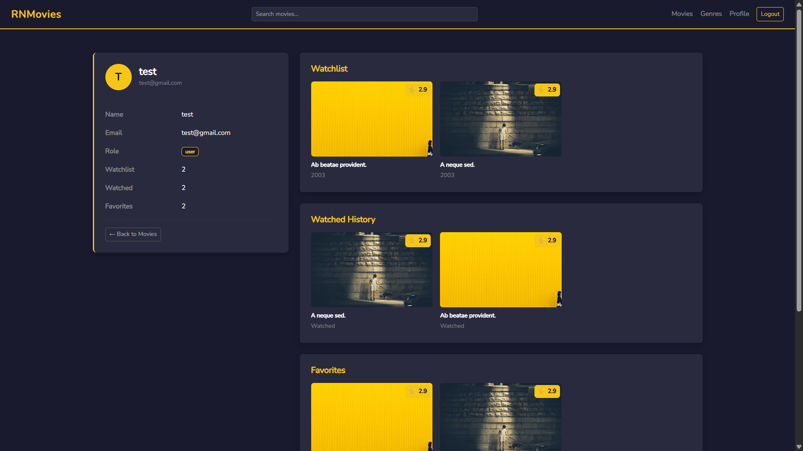
### Admin Dashbard
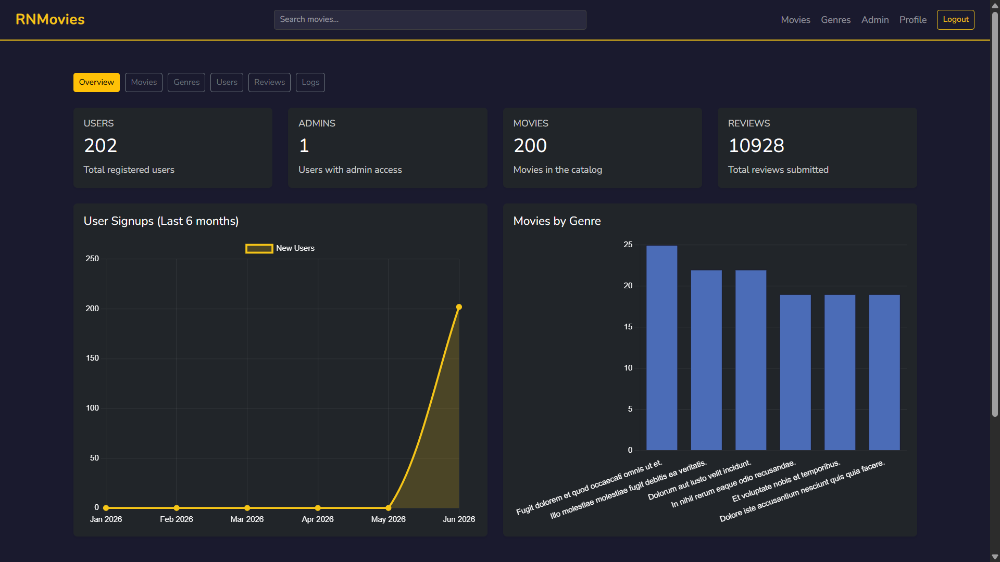
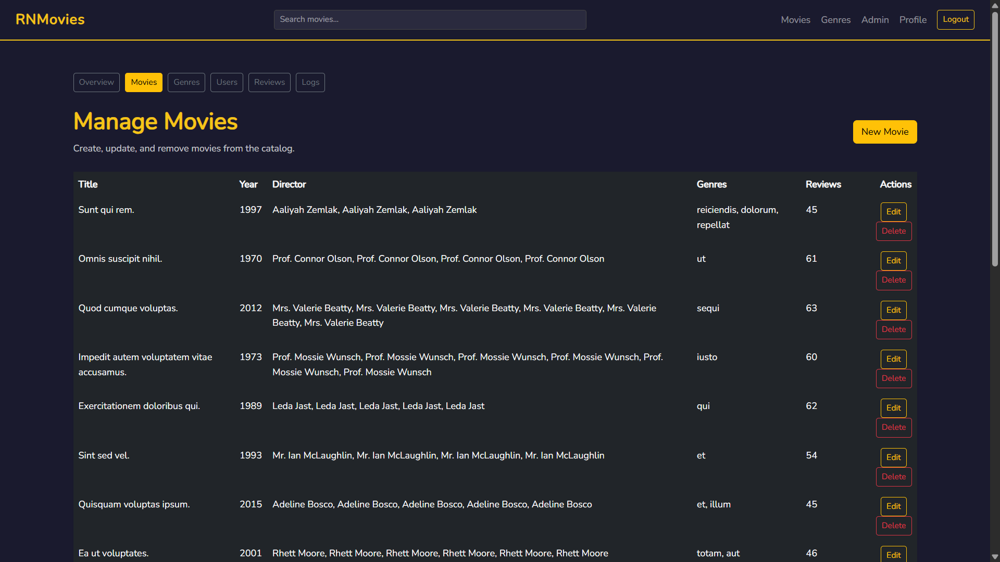

## Getting Started

1. Copy `.env.example` to `.env`
2. Install PHP dependencies: `composer install`
3. Install JavaScript dependencies: `npm install`
4. Build assets: `npm run build`
5. Run migrations: `php artisan migrate`
6. Start the application: `php artisan serve`

## License

This project is open source and available under the MIT license.
